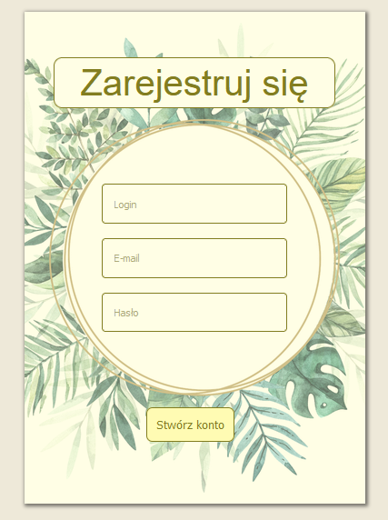
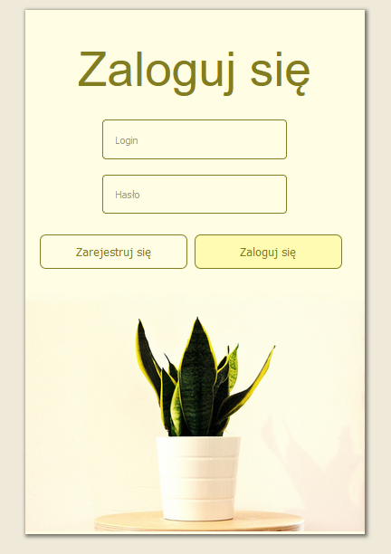
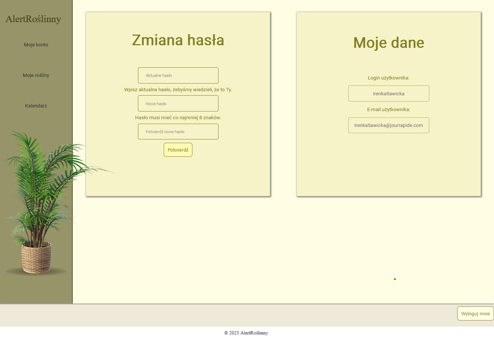
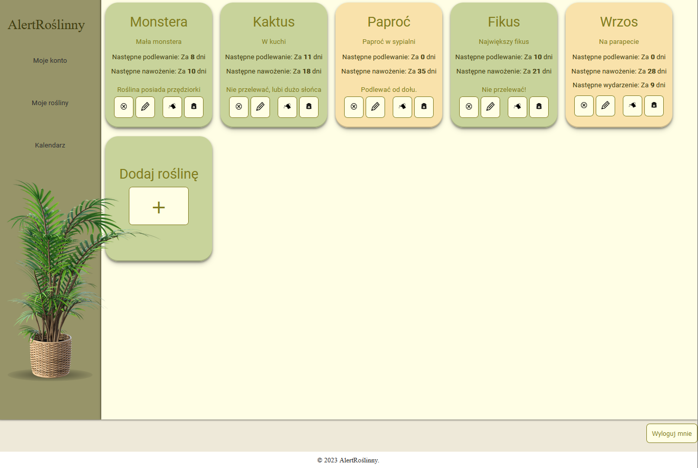
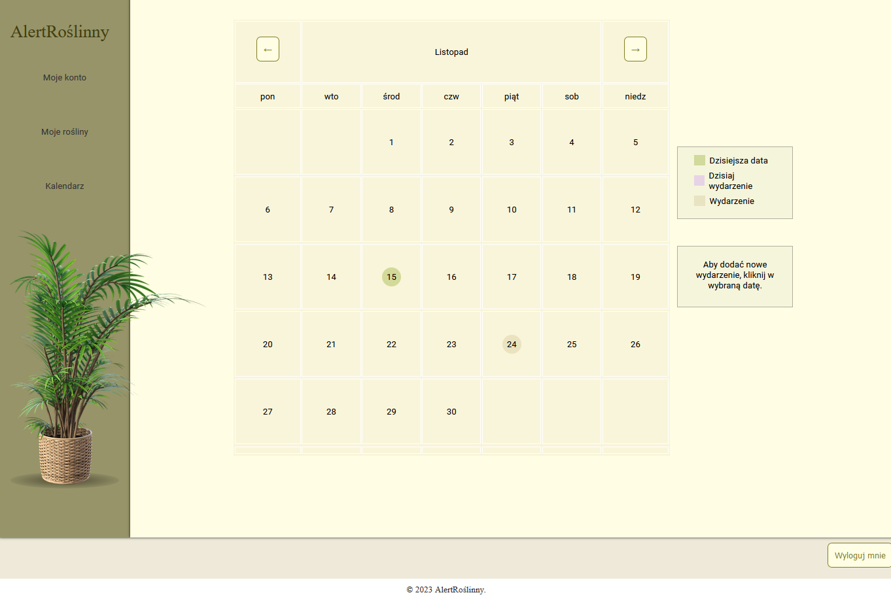

# PlantReminder
## Table of contents
* [Short description](#short-description)
* [Technologies](#technologies)
* [Detailed description](#detailed-description)
* [Installation](#installation)

## Short description

PlantReminder is a web
application. It was made using python’s library Flask. Its main goal is reminding the user when
he should water and fertilize plants or accomplish special event defined ealier. Functionalities
of this software allow user to add, edit and delete plants or special events and also approve the
watering or fertilization of a plant. Project has been completed and its result is a database system,
server application and client application have been deployed.
## Technologies
- Backend: Python (Flask, DataBase Connector),
- Frontend: JavaScript,
- Database: MySQL.

## Detailed description

To use this application, the user should first register and then log in. To register a new user account on the home page, click on the Register button.
This will take you to a sub-page with the registration form.  
The form contains text fields that the user must fill in and then press a button.  
The user is notified via an alert function whether the registration was successful.

The login form requires the details of a pre-registered user. Once correctly entered and confirmed, the user is redirected to the home page.

Application has 3 tabs:

The first tab in the side panel visible after logging in is My Account. This tab displays two containers. The left one allows you to change your password, while the
right one displays your user data. To change your password, you need to enter both your current password
as well as the new password twice. The correctness of the entered data is checked by the server. The user is informed by an
an alert that the password change was successful or failed

The second tab available to the user is My Plants.
Each tile shows data about the particular plant. These include the species name, an optional friendly plant name and an optional description. The number of days until the following actions are calculated: 
- next watering, 
- next fertilising,
- next special event associated with that plant. 

Each tile has four buttons:
- delete,
- edit,
- water it,
- fertilise.

The third tab available to the logged-in user is the calendar tab. It serves
for managing special events (adding, editing, deleting). The calendar is generated on the
the client application using a JavaScript function. The calendar has buttons to switch the view
for the previous and next month. It has the form of a table with days marked with the appropriate
colour (the current day and days with a scheduled event).

When you want to add a new event, click on the desired date. Once you have added an event, hovering over its day with the mouse brings up a tooltip displaying a list of events linked to that date. Next to each of these events
button is generated for deleting and editing it.

# Repository content

- `DataBase` is a folder with three SQL scripts. One creates tables, second creates views and third fills a example data;
- `documentations` is a folder with project files and screens,
- `ServerApp` is a folder where server application files are stored. In this directory there are backend python files and sub-folders:
  - `Static` is sub-folder which contains style css files, java scripts files and images used in application;
  - `Templates` is sub-folder which contains html template files.

# Installation

## Dependencies

- MySQL
- python 3
- flask
- MySQL Connector

## Running

1. Run the script `tworzenie_tabel.sql` in MySQL to create the tables and `tworzenie_widoku.sql`. Optionally you can run also `uzupelnienie_tabel.sql` to have some test data.
2. In the file `dbConnector.py` edit lines 14 - 16 to math with your database.
3. Run the script `main.py` in python.
4. Go to the api address in web browser (ip is given by flask in terminal).
